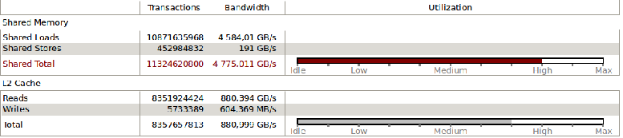

###### Filip Stefaniuk 361039
# CUDA Assignment
----------
## Overview
In my project I have implemented a Multi-Layered Perceptron with botch CPU and GPU support. I have used multiple optimization techniques and tested the program in several different configurations.

#### Project structure

There are two major elements in project structure. Preprocessing and frontend written in Python and neural network implementation written in c++ and CUDA C. I am compiling the c++ into a shared library object and using the functions from Python using ctypes.

##### Python
Part of the program written in python is responsible for handling the comand line arguments, reading and preprocessing the data, launching the neural network and writting the final result to a file. I am using standard Python libraries (argparse, PIL, ctypes). As a steps in preprocessing I convert images to greyscale, convert image class information to one-hot encoding, normalize and shuffle the input data.

##### C++/CUDA
My implementation of neural network has similar API to one for Sequential model in Keras. Model class is used for adding layers and running fit function. Each layer has methods for forward and backward pass. This allows me to flexibly change the network architecture.

I am using class Matrix to abstrac operations on higher level. I have managed to use common interface for c++ and CUDA, so it is possible to compile library with the same functions for different architectures. For the parts outside CUDA kernels i am using c++11.

#### Installing
After executing `make`, shared object library `lib/mlp.so` shoud be created.
Implementation for GPU is chosen by default. To compile code for cpu use `make mlp_cpu`.

#### Running
Program requires Python3 (runs on "arnold" without any additional configuration). Run program by executing:
```
$ ./mlp_gpu [options]
```
or
```
$ python ./mlp_gpu [options]
```
## CUDA Optimizations
In backpropagation algorihm the most computably intensive part is matrix multiplication so I focused mainly on optimizing this function. As I mentioned earlier I am using Matrix class to abstract operations. In CUDA implementation this class holds pointer to the device memory and all the operations are done without copying data between host and the device. Only time the copying happens is at the beginning (initializing weights and input/output matrix) and when the accuracy and cost values are returned.
For the profiling I ran the network without using batches to explore how it behaves with large matrices.

#### Block Size
I am using block size of (32, 32), the maximum number of threads in block. This gives the theoritical occupancy of 100% for SM which can procces 2 such blocks simultaneusly. When allocating memory for matrices, I round up the width and hight to the multiple of block size, and fill the remaining space with 0, so I don't have to check boundries in kernels.


#### Matrix Multiplication
Matrix multiplication is the most computable intensive part of program, it is ~98% of all computations.


I have started with implementing naive version of matrix multiplication, then I upgraded it to blocked algorithm that uses shared memory. This technique uses each thread in block to fetch one value from global to shared memory and then compute the result. Since the computation was bounded by memory bandwitch this significantly improved performance.


When fetching values from global memory I checked if there is proper memory alignment, so that each warp can read the memory in one operation.

Without proper memory alignment:


With memory alignment:


#### Matrix Transposition
In backpropagarion algorithm it is required to multiply transposed matrices. To save time on transposing I have implemented three versions of matrix  multiplications: normal and ones that assumes that left/right matrix must be transposed. This again slightly improved performance because matrix transposition was second most costly operation after matrix multiplication.


#### Grouping smaller oprtations
Smaller operations are grouped so theay are computed at one kernel launch, for example when cumputing actiavation i also compute it's derrivative.

#### Multiple Streams
I have tested version that uses multiple streams. It is possible in theory to update weights in neural network concurrently after all the delta values have been computed. In my final solution I abort this idea since the matrices are large (even when using batches) and all the SMs are occupied by the blocks from one operation which results in sequental execution.


#### Performance
Network implemented on CUDA performs much faster than the CPU version. It takes ~2.5 s for epoch without batches and ~4.5 s for batch gradient descent. These results are comparable with implementations from tensorflow.  

## Neural Network
Neural network API allows for creating network and adding layers. I've also implemented summary method which is useful for checking current network architecture.
In each epoch model computes time, cost and accuracy and prints it to standard output. 
I have tested several architectures with different features to check the correctness of my program.
[This](./logs/log01.txt) is result for example from moodle:
```./mlp_gpu --training_data /Training/ --epsilon 0 --learning_rate 0.01 --epochs 10 --random true```
#### MNIST
I have tested my network on standard benchmarking datased MNIST. (It is possible to compile this version of program by running `make mlp_test_cpu` or `make mlp_test_gpu`). [Model](./logs/log03.txt) with one hidden layer of 30 neurons reaches accuracy of 80% after 10 epochs.

#### Batches
I am training in batches of 32 examples which is standard for neural networks. Training in larger batches is a bit [faster](./logs/log02.txt) but with smaller ones it converges faster.

#### Bias
 I have added bias to shift the large values from deep layers towards 0 which helps softmax return proper values. Without bias with large values softmax cuts all the smaller values to 0 which results in "inf" cost (-log(0));

#### Large Network
Architecture of the neural network required in the assignment is too large for it to learn properly. This is due to several reasons. One of them is weight initialization witch is particularly important when using ReLU activations and which is random in our case.
Even slightly larger [network](./logs/log04.txt) for MNIST with ReLU with random weight initializations results in vanishing gradient. 
This is due to the dying ReLU problem. One solution would be to decrease learning rate but it causes network to learn extremely slow.
The proper solution to the above problems would be usage of adaptive learning rate and batch normalization, but implementation of these is not part of the assignment. Nevertheless I have tested that idea in keras:
[Network](./logs/log05.txt) from assignment with random weight initialization.
[Network](./logs/log06.txt) with proper weight initialization, rmsprop optimizer and batch normalization.
