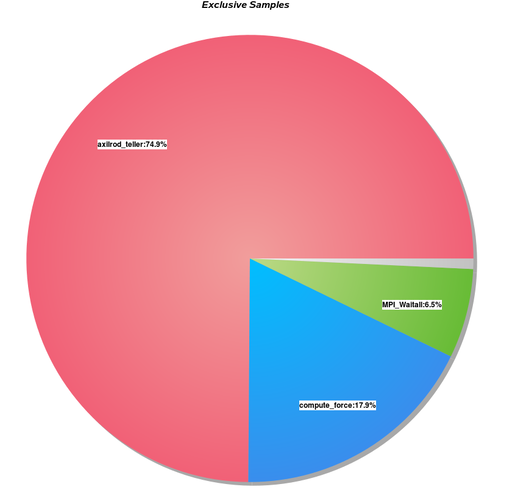
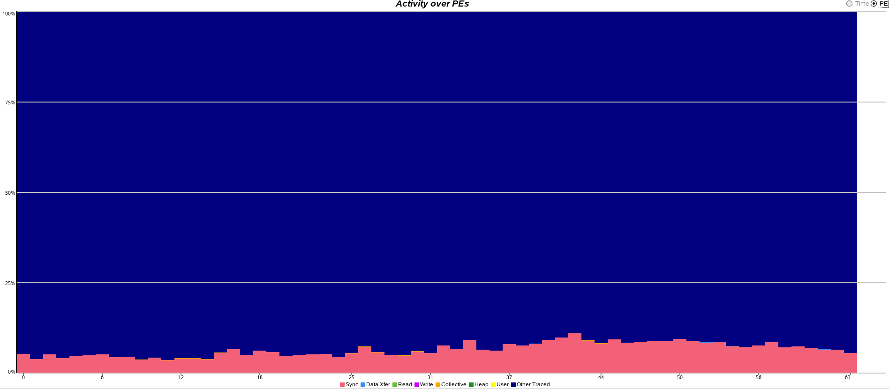
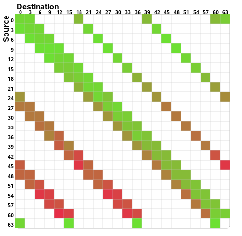
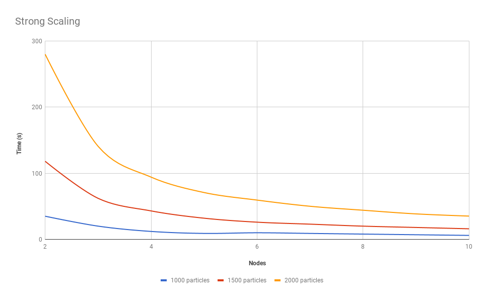

###### Filip Stefaniuk 361039
# MPI Assignment
## Overview
This is implementation of simple molecular simulator that computes Axilrod-Teller potential. Program is written in `c`. There are available two versions of this program, sequential and distributed with MPI.

#### Project structure
Both implementations use common functions to handle i/o and update particle's position, velocity and acceleration. The only difference is algorithm for potential computation. Implementations of these algorithms (alongside main function) are in subfolders named `seq` and `dist/`.

#### Instalation
Program requires `gcc` copiler and `mpicc` compiler for distributed version.
After executing `make`, program named `body3` should be created. This is default distributed veersion. To compile sequential version use `make body3-seq`.

#### Execution
Start program with:
```
./body3 particles_in.txt particles_out stepcount deltatime [-v]

```
or 
```
mpiexec ./body3 particles_in.txt particles_out stepcount deltatime [-v] 
```
for distributed version, where:

- **particles_in.txt** defines the initial positions and velocities, the format is one particle per line, each line consists of 3 doubles specifying the x, y, z coordinates of a particle (single space separated); then 3 doubles specifying the vx, vy, vz velocities of a particle.

- **particles_out** is the base name of the output file. The actual result (same format as the input file) must be saved in a file particles_out_stepcount.txt.

- **stepcount** is the total number of steps of the Verlet algorithm.

- **deltatime** gives t between steps.

- **[-v]**  if present, puts the result after each step i
(counted from 1) in a file particles_out_i.txt

## Implementation
I tried to reduce the communication between processes as much as possible. 

First I initialize sets by scattering particles between processes. I use `scatterv` so that difference of number of particles between each two sets is at most 1. At the end of the simulation (or after each step if using verboose) i use `gatherv` in the same manner.

Because all processes knows all the initial configurations i keep track of original owners and sizes of current buffers, so that the only message i have to exchange between processes are sets of particles. All the exchanges - initial, final and shifts are done in asynchronous manner.

#### Profiling
I have used profiler in sampling mode the images below shows that most time is spend on computation potential. I have ran simulation for 20 steps with 1000 particles (with command below):

```
./body3 particles_in.txt particles_out 20 0.1

```



The time spent on synchronisation is low:



Exchange of buffers:



## Numerical Intensity

#### Strong Scaling
For the strong scaling tests, I have run simulation with only one step, with number of particles equal to 500, 1500 and 2000. I fixed the number of tasks per node to **4**. Here are the results of increasing the number of nodes:

|    Nodes     | 1000 particles| 1500 particles | 2000 particles |
| :----------: |:-------------:| :-------------:|:--------------:|
| 1            |    0m35.12s   |      1m58.21s  |     4m39.71s   |
| 4            |    0m9.84s    |      0m32.66s  |     1m34.04s   |
| 8            |    0m7.53s    |      0m20.17s  |     0m44.03s   |
| 12           |    0m6.00     |      0m13.51s  |     0m27.10s   |



